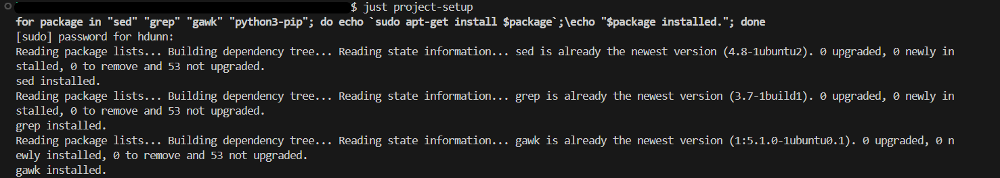
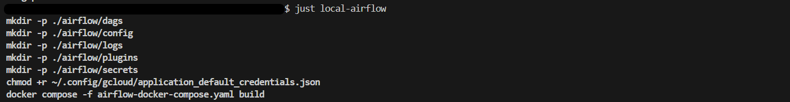
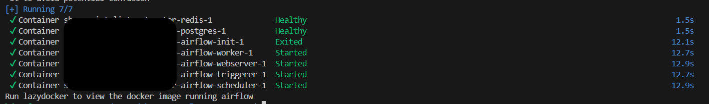
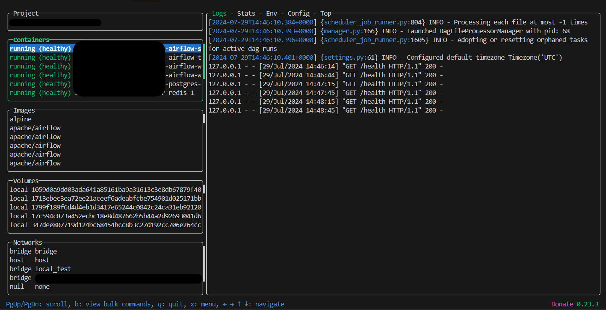
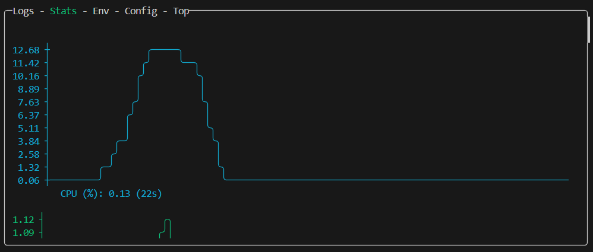
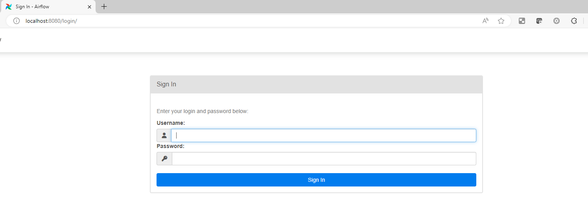
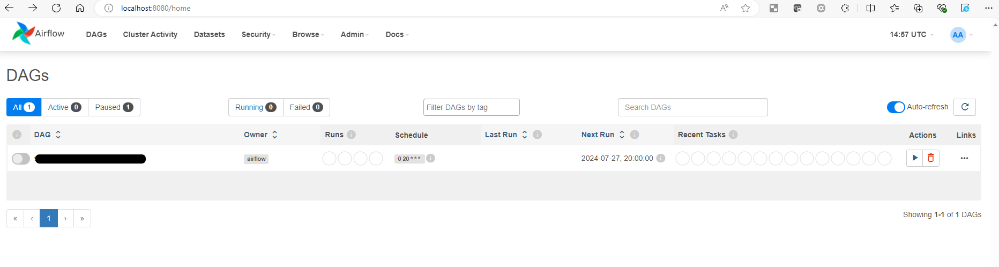
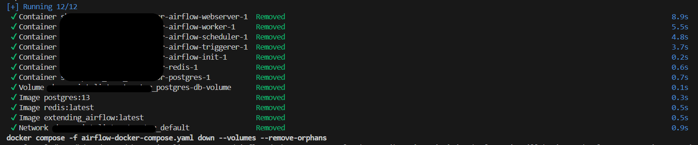

# Deploying Airflow Locally on WSL2 with Docker and Just

## Overview

Apache Airflow (or simply Airflow) is a platform to programmatically author, schedule, and monitor workflows. It is a great orchestration tool and can be powerful addition to your tech stack. This is especially true if you use Google Cloud Composer or Astronomer. But what about running it locally? How do you test that your DAG will work before you push it to your Development or Production environment?

I have found that the best way to run airflow locally is with **Docker** due to airflow needing subsequent parts to run as a whole. Docker can handle this by splitting these up into separate containers. The best two options I have found for utilising this Docker deployment are:

1. **Dev Containers** - A development container (or dev container for short) allows you to use a container as a full-featured development environment. It can be used to run an application, to separate tools, libraries, or runtimes needed for working with a codebase, and to aid in continuous integration and testing

2. **Docker with LazyDocker & Just** - Docker containers managed through the use of LazyDocker to monitor the environments. These containers are spun up and spun down through the use of a Justfile which runs specific commands to setup your environments and manage your docker containers.

The Dev Container setup is definitely the easiest. However I like the control that the second method gives you as I can monitor my airflow environment and adjust settings if needed. So, this article will go through the setup to run Airflow locally using Docker with LazyDocker & Just.

## Tech Stack

* **Docker:** https://www.docker.com/resources/what-container/
* **Just:** https://github.com/casey/just
* **LazyDocker:** https://github.com/jesseduffield/lazydocker
* **WSL2:** https://learn.microsoft.com/en-us/windows/wsl/about
* **Aiflow:** https://airflow.apache.org/
* **VSCode:** https://code.visualstudio.com/

This guide also shows how to ensure you are correctly setup with **Google Cloud Platform**, so you can correctly use variables and connections that have been setup in your secret manager.

## Setup

### Installation

* Ensure you have VS Code installed and python installed

* Ensure you have WSL installed and connected to VSCode

* Ensure you have python setup on WSL2: `sudo apt install python3 python3-pip ipython3`

* You are setup with GCP SDK: run `gcloud auth application-default login` and follow the steps (you may need to add --no-browser to the end as WSL doesn't have a built in browser, also use the default browser as it can fail otherwise). This should give you a credentials file in the location: ~/.config/gcloud/application_default_credentials.json.

* Install just. Just is built using the Rust programming language ([just git repo](https://github.com/casey/just)).
There are installation instructions in the repo. We have found the most success using `cargo`.
To install cargo you can use [rustup](https://rustup.rs/) to install the rust toolchain
(which cargo is a part of). You will also need to run `sudo apt install build-essential` this is to ensure you have a C linker installed. Once cargo is installed (ensure you follow the last command for setup`. "$HOME/.cargo/env"`) you can run cargo install just.

### Copy the Airflow & Just code

The key components are:

* **airflow-docker-compose.yaml** - contains the Basic Airflow cluster configuration for CeleryExecutor with Redis and PostgreSQL
* **airflow-docker-compose-lite.yaml** - contains the Basic Airflow cluster configuration for LocalExecutor
* **Dockerfile** - user Docker image so that you can install libraries from your requirements.txt
* **requirements.txt** - python libraries for use in airflow dag 
* **.airflowignore** - Ignore anything not ending with _dag.py
* **justfile** - Just commands for use as a command runner

* Example files: https://github.com/harryalexanderdunn/local-airflow-docker/tree/main

In this setup all connections and variables will be taken from your secret manager in gcp (this can be changed for AWS). This also assumes you have setup your variables and connections with the prefix setup below:

```json
{
"connections_prefix": "airflow-connections", 
"variables_prefix": "airflow-variables"
}
```
You can add variables & connections in the configuration as long as they have the prefix AIRFLOW_VAR or AIRFLOW_CONN.

!!! note "GCP Setup"

    To ensure you are setup with GCP, you will need GOOGLE_APPLICATION_CREDENTIALS set and mounted to the container.
    GOOGLE_APPLICATION_CREDENTIALS: /opt/airflow/plugins/application_default_credentials.json
    volumes:
    - ~/.config/gcloud/application_default_credentials.json:/opt/airflow/plugins/application_default_credentials.json:rw
    If this file is not found, please follow GCP setup step in the setup.

Volumes is important as that is what mounts your local file structure to the Docker Container. In this setup the dags are mounted from the root of your project and the other folders from the airflow folder. The .venv is also mounted to ensure there is no clash for the virtual environment.

### Run the project setup command to setup your libraries and virtual environment and docker

```
just project-setup
```



This will install any package manager dependencies, setup your .env file, setup your .venv file, install libraries in your .venv file, install docker and install lazydocker. 

### Run `local-airflow` to create a local airflow instance for local testing




This setup is in detached mode. So, once ready you can run lazydocker to monitor the containers. 
If this is your first time installing lazydocker, you may need to restart your WSL Distro.



See [here](https://medium.com/@seifeddinerajhi/lazydocker-the-docker-management-user-friendly-tool-that-will-save-your-time-2f5f42ce8e32) for more info on LazyDocker.


The password is airflow and the user is airflow. This can be altered in the configuration.


Large airflow instance with redis, workers, triggerer, scheduler, postgres and webserver
```bash
just local-airflow
```
small airflow instance with postgres and webserver
```bash
just local-airflow-lite
```

To shutdown the airflow instance run
```bash
just destroy-airflow
```
or
```bash
just destroy-airflow-lite
```



Ensure you run the destroy command to ensure the docker container is stopped. If you do not do this the container will continue to run in your WSL environment.

### The just file also has extra commands for docker & installation
```bash
# Docker commands
just clean-docker-containers
just force-remove-docker-containers
just show-running-containers
just show-all-containers

# Install requirements.txt on Virtual Environment
just install-libraries
just uninstall-libraries
```

### Now you are ready to start coding, running and testing your dags locally with airflow

### There are also other commands in the justfile including 

Update the project documentation (python docs, data dictionaries and unit tests)
```bash
just update-docs
```

This automates your documentation creation and before you are ready to commit your code, you can rerun this command to make sure your documentation is also up date with your changes.

If you have any questions on the above, feel free to reach out and I'll be happy to help.


