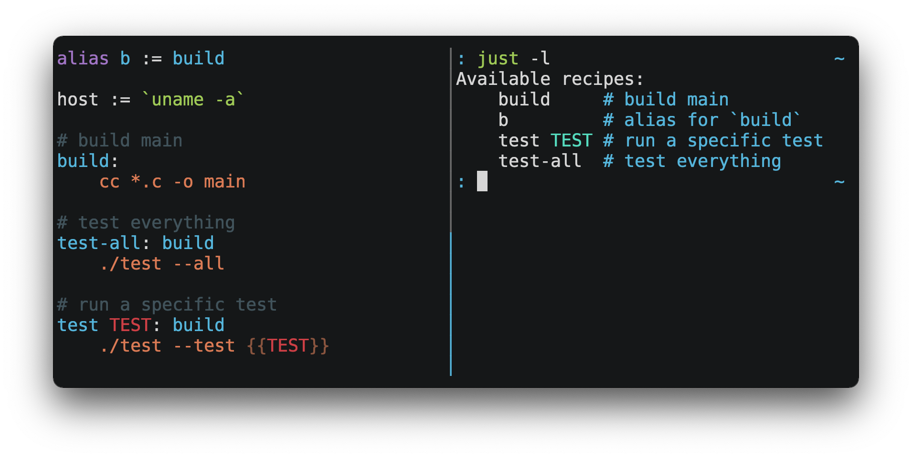

# Automating Project Repository setup & documentation creation with a Justfile

## Overview

`just` is a handy way to save and run project-specific commands. More information on just is located here: https://github.com/casey/just/tree/master

Commands, called recipes, are stored in a file called `justfile` with syntax inspired by `make`



You can then run them with `just RECIPE`:

```sh
$ just test-all
cc *.c -o main
./test --all
Yay, all your tests passed!
```

`just` has a ton of useful features, and many improvements over `make` which you can read about in the README document within just itself (https://github.com/casey/just/tree/master).

Just will be useful for overall setup of a project running specific commands and automating tasks. This would include:

* Virtual environment creation
* Libraries installation
* Local Environment variables setup (.env file) from secret manager
* Airflow instance setup through docker
* Repository Checks i.e summaries, linting etc
* Documentation automation

Specifically we are using Just here to run our virtual environment setup and documentation files. This will allow users to quickly get started on a virtual environment and use it within WSL2 and also ensure their documentation is up to date as their codebase progresses.

This is a work in progress, so as we add more automation we can add more to this justfile

## Prerequisites

Ensure you have Just available to run in WSL2. The best was to install just is to use cargo through rust.

1. To install rust: `curl --proto '=https' --tlsv1.2 -sSf https://sh.rustup.rs | sh`
2. to install just: `cargo install just`

For documentation automation we will be using lazydocs and the GCP data dictionaries automation code.

1. Ensure you have `lazydocs` within your requirements.txt
2. Ensure you have a docs folder with the data dictionaries automation script added, [article info](https://central-data-engineering-docs-dot-jlr-dl-complexity.nw.r.appspot.com/JLR%20DDPO%20Articles/Articles/Documentation%20Series/automating_data_dictionaries/) 

```
docs
  |-- assets
  |-- automation
        |-- data_dictionary.py
```

## Setup

Now you can start to create your justfile. Ensure the python version matches your repo and the folder structure aligns to the below for documentation.

**THIS IS CURRENTLY BEING REWRITTEN**

**I am planning to add more to this area, so you should see more to follow**. I am also not precious about the justfile vs makefile debate, so if you do have any thoughts send me a message. It would be great to get some outside opionion/thoughts on this and ideas for next steps.