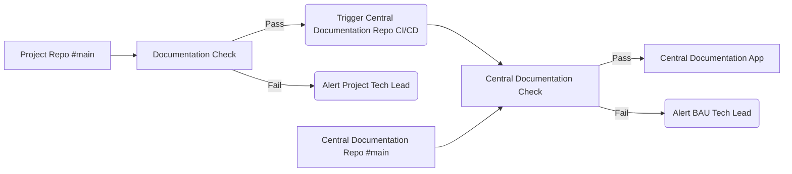

# Documentation as Code: Centralising documentation across multiple repositories (Methodology)

## Documentation as Code Philosophy

The generic goal of good documentation is to make finding information as easy as possible for either your user or developer. It should be clear, concise, avoid repetition and be up to date. Even though documentation is so important, as developers we know writing documentation can be boring and keeping it up to date can be a tedious process. This is where documentation as code becomes a crucial component to a developers arsenal. There are many articles on the internet explaining the benefits of documentation as code, so this will not be another one of them. This article is to describe a methodology to create and maintain a centralised documentation as code repository for your team.

## Problem Statement

The Philosophy for documentation as code is simple, "documentation is created and managed using the same tools/workflows as your software development team". This creates an efficient, structured and organised methodical approach to documentation. It works really well for singular projects or small teams to create complete documentation.

A big issue starts to show when teams get bigger, repositories grow & more and more repositories and folders are created across your software development platform. **How do you deploy and maintain this documentation codebase?**

!!! note

    I want to be able to allow teams to write documentation as code within their repositories but not have to worry about deployment or management of a documentation site.

## The Solution

There are many solutions you could use to solve this problem. These solution generally come under two headings;

1. **Create a centralised documentation repository, containing just documentation for all other repositories**
2. **Create a centralised repository that extracts the documentation from the other repositories**

Solution 1 although simplistic does not work for me as I want to keep my documentation within the repository it is documenting. This is because it would allow for documentation automation within the repository *(An article for another day)*. This meant a centralised repository was needed and furthermore it needed to connect to any child repositories. A child repository in this scenario is a separate repository to the centralised repository, it can be any repository in any location on the software development platform. This child repository will have its documentation linked to a deployed centralised site.

### Tech Stack

To Achieve this I need to choose a tech stack. There is a plethora of choices out there and certain factors may push you towards a different route. In this case I am working within Google Cloud Platform and I am using Gitlab as the software development platform.

* [**Markdown**](https://www.markdownguide.org/): Documentation will be written, formatted and displayed using markdown.
* [**MkDocs Material**](https://squidfunk.github.io/mkdocs-material/): Documentation will be created using MkDocs. Specifically MkDocs Material was chosen because of its variety of plugins and extras to give extended capabilities for the user.
* [**GitLab**](https://about.gitlab.com/): Software development platform where all of our code is stored. (This also works on Github).
* [**App Engine**](https://cloud.google.com/appengine?hl=en):  Fully managed, serverless platform for developing and hosting web applications at scale.

The main reason for choosing MkDocs Material is it's **Simplicity**. MkDocs Material has a variety of plugins available which make the tool very powerful. One of which is the [mono repo plugin](https://github.com/backstage/mkdocs-monorepo-plugin), which allows you to connect the documentation of multiple repositories in one convenient location using submodules. This means that a team can decide whether to host their own documentation site using MkDocs or use the central site which will be hosted for them. The diagram below shows how the process would flow from a child repository to centralised repository.

There is also another plugin called [multi repo plugin](https://github.com/jdoiro3/mkdocs-multirepo-plugin). Unlike the mono repo plugin it does not use submodules. This means you can still Keep your documentation close to your code and it be findable on one site. But, with this implementation submodules do not need to be downloaded or updated on the central repository. I am currently looking at implementing this plugin within gitlab. However, I am experiencing bugs with the gitlab integration. I will write up an update when those bugs are fixed. The Github integration is currently bug free, making it an excellent choice if you are using Github.

### Overview of MkDocs Material

It's very simple to get started with MkDocs Material, they have a great guide located [here](https://squidfunk.github.io/mkdocs-material/getting-started/).

I recommend using MkDocs Material over its competitors as it has a substantial amount of plugin extensions as well as a sponsorware release strategy. You have the choice to pay for premium features through it's sponsor service or you can use the open source version. As more people/companies subscribe to the subscription service more features are released to the open source version. I like this model as it generates stability and if you want further features you can pay a small fee to join the "insiders" community.

As mentioned above MkDocs was chosen because of its mono repo plugin & multi repo plugin. I have also listed some other MkDocs plugins below that I have found to be useful:

1. [mkdocs-mermaid2](https://github.com/fralau/mkdocs-mermaid2-plugin)
2. [neo](https://github.com/Neoteroi/mkdocs-plugins)
3. [mkdocstrings](https://mkdocstrings.github.io/)
4. [mkdocs_macros_plugin](https://github.com/fralau/mkdocs_macros_plugin)
5. [mkdocs-pdf-export-plugin](https://github.com/zhaoterryy/mkdocs-pdf-export-plugin)

### Deploying your Documentation Site

Once you have a central site running locally you will not want to serve this site forever from your laptop/computer, so you will need to host this site somewhere. There are some great choices for website hosting out there and as this is a static site the options will also be cheap. I won't go in to details of the options as I chosen Google Cloud Platform - App Engine. I have chosen to host it with [App Engine](https://cloud.google.com/appengine?hl=en) as it fits seamlessly into my tech stack with the covered service providing a Monthly Uptime Percentage to the customer of at least 99.95%. The static sites on App Engine do not need any compute power so the costs are also minimal. This gives me stability and cost effectiveness for my site. The added bonus of App Engine is that is integrated with Google's [Identity Aware Proxy](https://cloud.google.com/iap?hl=en) which is used to guard access to the application.

To deploy this app I will be using a CI/CD pipeline within gitlab. Referring to our diagram at the beginning of the article I want to be able to push changes from my child repository into my central repository. This is done indirectly by triggering the central repository through a push to the main branch on a child repository. Another option is to set a schedule on the central repository CI/CD pipeline to update periodically i.e every hour/day (I would recommend this option if your central repository becomes very large). Once deployed this provides me with a central site that displays up to date documentation that is easy to create, manage and update. Documentation doesn't have to be an afterthought or a chore anymore.

## Technical implementation

I have written an article on the technical implementation of this solution which covers,

* MkDocs Material setup
* MkDocs Monorepo setup
* Submodule setup
* CI/CD setup in Gitlab
* App Engine deployment within Gitlab
* Identity-Aware Proxy setup

For this technical article please follow this [link](central_docs_technical.md)
