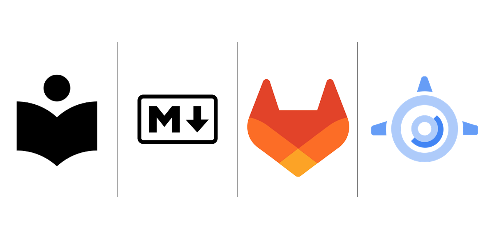

# Documentation as Code: Centralising documentation across multiple repositories (Technical Implementation)

This article walks you through the technical implementation of creating & deploying a centralised documentation site linking multiple repositories across your software development platform. Please Read this [article](central_docs_methodology.md) if you want a deeper understanding of what I am creating in this technical walkthrough.



---

## Problem Statement

!!! note "The Goal"

    I want to be able to allow teams to write documentation as code within their repositories but not have to worry about deployment or management of a documentation site. In this walkthrough we will refer to these repositories as child repositories.

---

## The Solution

!!! success "The Solution"

    Create a centralised repository that extracts the documentation from the other repositories using the tech stack listed below. This centralised repository will deploy a centralised site hosting this documentation for users and developers to access.

---

## Tech Stack

* [**Markdown**](https://www.markdownguide.org/): Documentation will be written, formatted and displayed using markdown.
* [**MkDocs Material**](https://squidfunk.github.io/mkdocs-material/): Documentation will be created using MkDocs. Specifically MkDocs Material was chosen because of its variety of plugins and extras to give extended capabilities for the user.
* [**GitLab**](https://about.gitlab.com/): Software development platform where all of our code is stored. (This also works on Github).
* [**mono repo plugin**](https://github.com/backstage/mkdocs-monorepo-plugin): MkDocs plugin to connect the documentation of multiple repos in one convenient location using submodules.
* [**App Engine**](https://cloud.google.com/appengine?hl=en): Fully managed, serverless platform for developing and hosting web applications at scale.
* [**Identity-Aware Proxy**](https://cloud.google.com/iap?hl=en): IAP lets you establish a central authorization layer for applications accessed by HTTPS, so you can use an application-level access control model instead of relying on network-level firewalls.

There is also another plugin called [multi repo plugin](https://github.com/jdoiro3/mkdocs-multirepo-plugin). Unlike the mono repo plugin it does not use submodules. This means you can still Keep your documentation close to your code and it be findable on one site. But, with this implementation submodules do not need to be downloaded or updated on the central repository. I am currently looking at implementing this plugin within gitlab. However, I am experiencing bugs with the gitlab integration. I will write up an update when those bugs are fixed. The Github integration is currently bug free, making it an excellent choice if you are using Github.


---

## Creating a Documentation Site using MkDocs

It's very simple to get started with MkDocs, they have a great guide located [here](https://squidfunk.github.io/mkdocs-material/getting-started/).

I'll outline the key points below:

**Step 1:** Create a Repository with the structure below, where index.md is your home page:

```txt
├─── docs
|    └─── index.md
├─── overrides
├─── mkdocs.yml
└─── requirements.txt   
```

Ensure all your documentation is located within the docs folder. The overrides folder can be used to override settings set by MkDocs. More information about this can be found on the MkDocs Material website *(This folder will not be explored in this article)*. The requirements.txt file should contain any installed libraries. I would recommend using specific versions tailored to your python version as this aligns with best practices. The below is for python 3.9.

```txt
mkdocs==1.4.3
mkdocs-material==9.1.3
markdown==3.3.7
mkdocs-monorepo-plugin
```

below are the basic settings I recommend for starting out on MkDocs Material. These settings give you a good starting point for using markdown to its full potential. Importantly it lets you use [mono repo](https://github.com/backstage/mkdocs-monorepo-plugin) to connect child repositories to the central repository. I would recommend researching the extensions so you can edit the design of the site yourself.

```yaml
site_name: Central Documentation Site
site_description: 'A template for future MkDocs wikis'
site_author: 'tbc'

copyright: |
  &copy; Author

nav:
  - Home: 
    - index: 'index.md'

plugins:
  - search:
      separator: '[\s\-,:!=\[\]()"`/]+|\.(?!\d)|&[lg]t;|(?!\b)(?=[A-Z][a-z])'
  - monorepo

theme:
  name: material
  custom_dir: overrides
  features:
    - announce.dismiss
    - content.code.annotate
    - content.code.copy
    - content.tabs.link
    - content.tooltips
    - navigation.footer
    - navigation.indexes
    # - navigation.sections
    - navigation.tabs
    - navigation.tabs.sticky
    - navigation.top
    - search.highlight
    - search.share
    - search.suggest
    # - toc.follow
  language: en
  palette:
    - scheme: default
      primary: indigo
      accent: indigo
      toggle:
        icon: material/brightness-7
        name: Switch to dark mode
    - scheme: slate
      primary: indigo
      accent: indigo
      toggle:
        icon: material/brightness-4
        name: Switch to light mode
  shortcuts:
    help: 191 # ?
    next: 78 # n
    previous: 80 # p
    search: 83 # s
  font:
    text: Roboto
    code: Roboto Mono
  icon:
    logo: 'material/library'
    repo: 'material/library'
    admonition:
      note: octicons/tag-16
      abstract: octicons/checklist-16
      info: octicons/info-16
      tip: octicons/flame-16
      success: octicons/check-16
      question: octicons/question-16
      warning: octicons/alert-16
      failure: octicons/x-circle-16
      danger: octicons/zap-16
      bug: octicons/bug-16
      example: octicons/beaker-16
      quote: octicons/quote-16
      data: octicons/database-16
      squirell: octicons/squirrel-16
      goal: octicons/goal-16
      rocket: octicons/rocket-16

markdown_extensions:
  - abbr
  - admonition
  - attr_list
  - def_list
  - footnotes
  - md_in_html
  - markdown_inline_graphviz
  - mdx_truly_sane_lists
  - plantuml_markdown
  - tables
  - pymdownx.critic
  - pymdownx.caret
  - pymdownx.details
  - pymdownx.extra
  - pymdownx.inlinehilite
  - pymdownx.keys
  - pymdownx.mark
  - pymdownx.magiclink
  - pymdownx.smartsymbols
  - pymdownx.snippets
  - pymdownx.tilde
  - toc:
      permalink: true
  - pymdownx.arithmatex:
      generic: true
  - pymdownx.betterem:
      smart_enable: all
  - pymdownx.emoji:
      emoji_index: !!python/name:materialx.emoji.twemoji
      emoji_generator: !!python/name:materialx.emoji.to_svg
      options:
        custom_icons:
          - overrides/.icons
  - pymdownx.highlight:
      anchor_linenums: true
      line_spans: __span
      pygments_lang_class: true
  - pymdownx.tabbed:
      alternate_style: true
  - pymdownx.tasklist:
      custom_checkbox: true
```

**Step 2:** Create a virtual environment and Install MkDocs Material, this can be done using pip (ideally) in a virtual environment. To install Material for MkDocs open up a terminal and run the command at your root level:

```bash
workon <environment_name>
```

```bash
pip install -r requirements.txt
```

**Step 3:** MkDocs has two options for creating the site, `serve` and `build`. `mkdocs build` will build your site in a directory called "site" at your root. MkDocs also comes with a built-in dev-server that lets you preview your documentation as you work on it. This is created by running the serve command at your root level. This will serve your site on `http://localhost:8000/`.

```bash
mkdocs serve
```


**Step 4:** Open up `http://localhost:8000/` to see your site locally. You now have a central documentation site using MkDocs, this is where you can create centralised documentation for your team. You should see a page similar to the screenshot below.


### Implementing MkDocs Monorepo Plugin

We now have a central documentation repository, where documentation can be added and organised into directories within the repo. The monorepo plugin has been installed and is now ready to use, so now we can connect our child repositories. The monorepo plugin works by using git submodules. This means that the central repository brings in a child repository's documentation using git submodules.

The submodule approach means that for every repository you wish to connect to the site, it first needs to be added using git submodules

**Step 1:** Create directories for the specific child repository locations in your central repository.

```txt
├─── docs
|    ├─── top_secret_repos
|    └─── index.md
├─── overrides
├─── mkdocs.yml
└─── requirements.txt 
```

**Step 2:** Create or use an already built child repository and ensure your documentation within this repository is written in markdown, is legible and is located within a docs folder. You can add an index page in this docs folder to also have a front page for your site. This will also be viewable in Gitlab when you open your repository in Gitlab and look in the docs folder. This index page can be different or identical to your readme page at root level in your repo. In this scenario I have added the markdown files in the structure below.

```txt
└─── docs
    ├─── index.md
    └─── secret_logic.md
```

**Step 3:** Create an mkdocs.yml file at the root level in your repo. This yaml file must contain a **site_name** (*project directory*/*repo_name*) a **docs_dir** (./docs) and a **nav**. below is a example of what the yaml should look like. This yaml defines where your documentation will be structured in the site. You can move the files around in the nav section for how you want your documentation to be shown. **If a md page is not listed in the nav section, it will not appear on the site**. *Ideally your site name should follow the path of your submodule in your central repository*

```yaml
site_name: top_secret_repos/top-secret-repo-one

docs_dir: ./docs

nav:
- Home: 'index.md'
- More Docs: 
    - Logic: 'top_secret/secret_logic.md'
```

**Step 4:** Add your child repository as a submodule to your central repository by running the git submodule command below.

```bash
git submodule add git@"gitlab_domain":top-secret-repo-one.git docs/top_secret_repos/top-secret-repo-one
```

By adding "docs/top_secret_repos/top-secret-repo-one" at the end of the command it specifies where you would like to store your submodule within the directories of the central repository.

For the submodule to link properly it has to use a relative path which is linked by editing .gitmodules. If your central repository and you child repository are both at the root level of your gitlab instance you would follow the url pattern below. The url follows the relative position of the child repo in relation to the central repository. i.e if the child repo was in a project called "Projects" the url would be `url = ../Projects/top-secret-repo-one.git`.

```bash
[submodule "docs/top_secret_repos/top-secret-repo-one"]
    path = docs/top_secret_repos/top-secret-repo-one
    url = ../top-secret-repo-one.git
```

Run the command below to ensure your central repository has the latest up to date submodule:

```bash
git submodule update --remote --merge
```

The repository structure will now look like this:

```txt
├─── docs
|    ├─── top_secret_repos
|    |    └─── top-secret-repo-one
|    └─── index.md
├─── overrides
├─── mkdocs.yml
└─── requirements.txt 
```

**Step 5:** You can now add the submodule to your nav section in the central repositories mkdocs.yml. ```yaml '!include ./docs/project-repo/mkdocs.yml'```. This tells mkdocs to bring through the mkdocs.yml file within your submodule and attach the information to the nav section.

```yaml
nav:
  - Home: 
    - index: 'index.md'
  - Top Secret Repo 1: '!include ./docs/top_secret_repos/top-secret-repo-one/mkdocs.yml'
```

And that's it! 🚀 Your project is now connected to the central repository and your child repository's documentation can be rendered on a centralised documentation site. To test this run `mkdocs serve` to bring through your child repositories documentation into the central site. Open up `http://localhost:8000/` to view this documentation.


If you want to add more child repositories to the central repository just repeat the steps above for your other child repositories and your central documentation site will start to grow. If anyone wants to add a new repository to the central site this can be achieved with a merge request.

---

## Deploying your Documentation Site

You now have a central site running locally. But you cannot serve this site forever from your laptop/computer, you need to host this site somewhere. I have chosen to host the site using [App Engine](https://cloud.google.com/appengine?hl=en) as it fits seamlessly into my tech stack with the covered service providing a Monthly Uptime Percentage to the customer of at least 99.95%. The static sites on App Engine do not need any compute power so the costs are also minimal. This gives me stability and cost effectiveness for my site. The added bonus of App Engine is that is integrated with Google's [Identity-Aware Proxy](https://cloud.google.com/iap?hl=en) which is used to guard access to the application.

To deploy this app I will be using a CI/CD pipeline within gitlab. Referring to our diagram at the beginning of the article we want to be able to push changes from our child repository into our central repository. This is done indirectly by triggering the central repository through a push to the main branch on a child repository. Another option is to set a schedule on the central repository CI/CD pipeline to update periodically i.e every hour/day (I would recommend this option if your central repository becomes very large).

### App Engine Setup with Identity-Aware Proxy (IAP)

**App Engine requirements:**

* Ensure the App Engine API is enabled
* Ensure the Identity-Aware Proxy (IAP) API is enabled
* Ensure your Gitlab service account has the App Engine Deployer permission in IAM
* App Engine Admin is useful for utilising App Engine to its full potential
* IAP Admin is useful for implementing access control

Once the App Engine API is enabled, click create an application to get started. Configure the application to get setup, choose the location and service account for your default application. The first app created on App Engine has to be called default.


Once the IAP API is enabled go to the [main page](https://console.cloud.google.com/security/iap?) where you may see a red banner. This will appear if your project does not have an OAuth consent screen. To do this click on the "configure consent screen" button. Your consent screen will apply to your whole project and you have the choice to make it internal or external to your organisation. The key fields to fill out are:

* App name
* User Support Email
* Developer contact information


The other fields can be added or left blank. It will then ask you for oauth scopes, none are needed for this application so you can save and continue without filling this in. Once applied it will show you a summary of your consent screen. This screen will appear if users need to sign in or have been restricted access to the application.

If you need any extra information look at the google guide on this topic: [https://cloud.google.com/beyondcorp-enterprise/docs/securing-app-engine](https://cloud.google.com/beyondcorp-enterprise/docs/securing-app-engine)

### Gitlab CI/CD Setup

**Step 1:** In Gitlab you need to ensure that the child repository has the ability to trigger the central repository. Otherwise you cannot trigger the central CI/CD pipeline from your child repository and so the central repository cannot get the docs from your child repository. To do this you must add the **central repository** to the Token Access section in your child repository's CI/CD settings. To do this open CI/CD settings and click add project.


**Step 2:** Add files to your central repository.

To create a CI/CD pipeline within the central repository you need to add a .gitlab-ci.yml file. You also need an app.yaml file to specify the settings/setup for your app.

```txt
├─── docs
|    ├─── top_secret_repos
|    |    └─── top-secret-repo-one
|    └─── index.md
├─── .gitlab-ci.yml
├─── app.yaml
├─── overrides
├─── mkdocs.yml
└─── requirements.txt 
```

The app.yaml file follows a standard template from google. The first app you ever make must be called default, after that the service name can be uniquely named. The yaml file is setup to use the site directory *created from mkdocs build* in the central repository.

```yaml
runtime: python39
service: default

handlers:
  # static files with a URL ending with a file extension
  # (e.g. favicon.ico, manifest.json, jylade.png)
  - url: /(.*\..+)$
    static_files: site/\1
    upload: site/(.*\..+)$

  # index page
  - url: /
    static_files: site/index.html
    upload: site/index.html

  # anything that ends with a slash (e.g. /docs/)
  - url: /(.*)/$
    static_files: site/\1/index.html
    upload: site/(.*)

  # anything else (e.g. /docs)
  - url: /(.*)
    static_files: site/\1/index.html
    upload: site/(.*)
```

The .gitlab-ci file needs to have a deploy stage, a validate stage can be added if necessary. In this we will need to pull in the submodules and authenticate to GCP. To do this you will need to have a Service account key held in your CI/CD variables (For best practice, link this variable to a secret key in your software development platform).

```yaml
.gcp-authentication: &gcp-authentication
    - echo $GCP_SERVICE_ACCOUNT_KEY > gcloud-service-key.json 
    - gcloud auth activate-service-account --key-file gcloud-service-key.json && rm gcloud-service-key.json
```

To pull in submodules you need the code below, this will pull the latest code from the submodules into the CI/CD stage.

```yaml
variables:
    GIT_SUBMODULE_STRATEGY: recursive

.pull-submodules: &pull-submodules
    - git submodule sync --recursive
    - git submodule update --remote --recursive
```

Now to deploy the site you need the following steps run on the cloud sdk image.

* **Install libraries** `pip install -r requirements.txt`
* **pull submodules** `*pull-submodules`
* **build documentation pages into site folder ready for deployment** `mkdocs build`
* **Authenticate to gcp** `*gcp-authentication`
* **Deploy app in App Engine** `gcloud app deploy app.yaml --project $GCP_PROJECT_ID --quiet`

```yaml
variables:
    GIT_SUBMODULE_STRATEGY: recursive

stages:
- deploy

.gcp-authentication: &gcp-authentication
    - echo $GCP_SERVICE_ACCOUNT_KEY > gcloud-service-key.json 
    - gcloud auth activate-service-account --key-file gcloud-service-key.json && rm gcloud-service-key.json

.pull-submodules: &pull-submodules
    - git submodule sync --recursive
    - git submodule update --remote --recursive

deploy_static_site:
  stage: deploy 
  image: google/cloud-sdk
  script:
    - pip install -r requirements.txt
    - *pull-submodules
    - mkdocs build
    - *gcp-authentication
    - gcloud app deploy app.yaml --project $GCP_PROJECT_ID --quiet
```

The above will create the starting point to deploy a site from your central repository. Below I have added a split if you want to deploy two apps, one for develop and one for production. The sed command allows for a change in the app name within the yaml file. Another solution is to use a dev/prod app.yaml file.

```yaml
variables:
    GIT_SUBMODULE_STRATEGY: recursive

stages:
- deploy

.gcp-authentication: &gcp-authentication
    - echo $GCP_SERVICE_ACCOUNT_KEY > gcloud-service-key.json 
    - gcloud auth activate-service-account --key-file gcloud-service-key.json && rm gcloud-service-key.json

.pull-submodules: &pull-submodules
    - git submodule sync --recursive
    - git submodule update --remote --recursive

deploy_static_site_dev:
  stage: deploy 
  image: google/cloud-sdk
  script:
    - pip install -r requirements.txt
    - *pull-submodules
    - mkdocs build
    - *gcp-authentication
    - sed -i 's/${APP_NAME}/central-docs-dev/g' app.yaml && gcloud app deploy app.yaml --project $GCP_PROJECT_ID --quiet
  only:
    refs:
      - develop

deploy_static_site:
  stage: deploy 
  image: google/cloud-sdk
  script:
    - pip install -r requirements.txt
    - *pull-submodules
    - mkdocs build
    - *gcp-authentication
    - sed -i 's/${APP_NAME}/central-docs/g' app.yaml && gcloud app deploy app.yaml --project $GCP_PROJECT_ID --quiet
  only:
    refs:
      - main
```

**Step 3:** To trigger on demand updates to the central repository from the child repository a step is needed within the child repository's CI/CD pipeline. Before the trigger I want validation of the mkdocs.yml file to ensure it wont break the central site. This is achieved by validating the yaml and doing a test build on the child repository's documentation.

```yaml
validate_yaml:
    stage: validate
    image: sdesbure/yamllint
    tags:
        - validate
    script:
        - yamllint mkdocs.yml

validate_build:
    stage: validate
    image: google/cloud-sdk
    tags:
        - validate
    script:
        - pip install mkdocs
        - mkdocs build
```

Add a release stage to trigger the central repository CI/CD pipeline. I have added the variables UPDATE_DOCS & DOCS_PROJECT_NAME for future use in the central repository.

```yaml
validate_yaml:
    stage: validate
    image: sdesbure/yamllint
    tags:
        - validate
    script:
        - yamllint mkdocs.yml

validate_build:
    stage: validate
    image: google/cloud-sdk
    tags:
        - validate
    script:
        - pip install mkdocs
        - mkdocs build

update:references:
    trigger:
    branch: 'main'
    project: central-repo-name
    strategy: depend
    stage: release
    only:
        - main
    variables:
        UPDATE_DOCS: 'true'
        DOCS_PROJECT_NAME: '${CI_PROJECT_NAME}'
```

```yaml
    only:
        - main
```

The `only:` code in the yaml ensures this step is only run when a push is made to the main branch. The central repository should only contain production documentation.

**Step 4:** Now push a documentation change to your main branch in your child repository. And sit back relax and wait for deployment. I have added an example of a CI/CD flow in the picture below. Every time a change is pushed to the main branch in your child repository it will trigger the central repo to update and refresh the central site.


### Accessing the Central Site

**Step 1:** Once the CI/CD pipeline has passed you'll be able to see the deployment in App Engine. You'll be able to see the app on the services page. Click on the app name to open up the URL. You will be able to access the site as IAP on the site has likely not been enabled.


**Step 2:** Go to the IAP page and the new application will appear under the name default. Enable IAP by toggling the IAP button, once enabled you will be able to set permissions.


**Step 3:** If you go back to the app you should see the consent screen we made earlier restricting you access to the site. To provide users access to the site you need to add them within the IAP page.


**Step 4:** This next step will need IAP admin privileges. In the IAP page, if you click on the app a panel will appear giving you access options. Add users to the site by granting them the IAP-secured Web App User permission. This can be at a user level, google groups level or domain level. You can choose how you control access to the site. It may take a few minutes for updates to be applied.

!!! success "You are all setup!"

    When you go back to your app's URL you will have access to roam the site. Your centralised documentation site is up and running ready to serve your users.

---

## Summary

I hope this has helped you get started with creating a centralised documentation site for yourself and/or your team. 

What's exciting about this setup is its potential for expansion creating some brilliant automated documentation. I will be adding more information on this topic in future articles.
