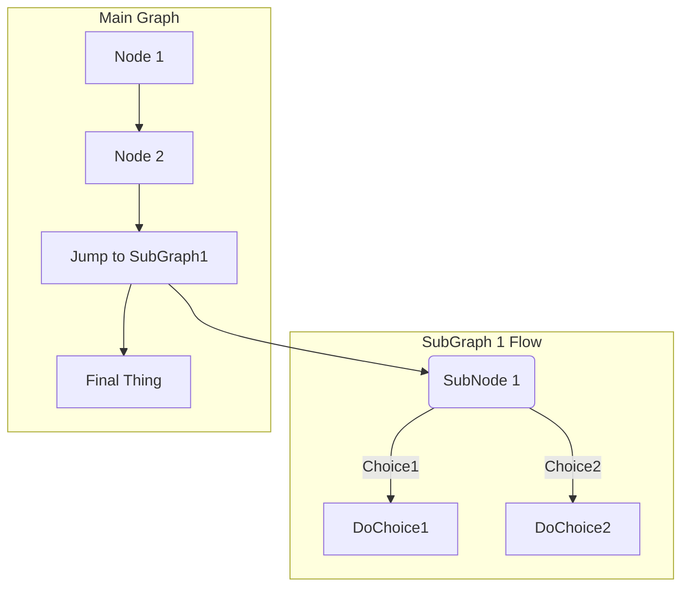
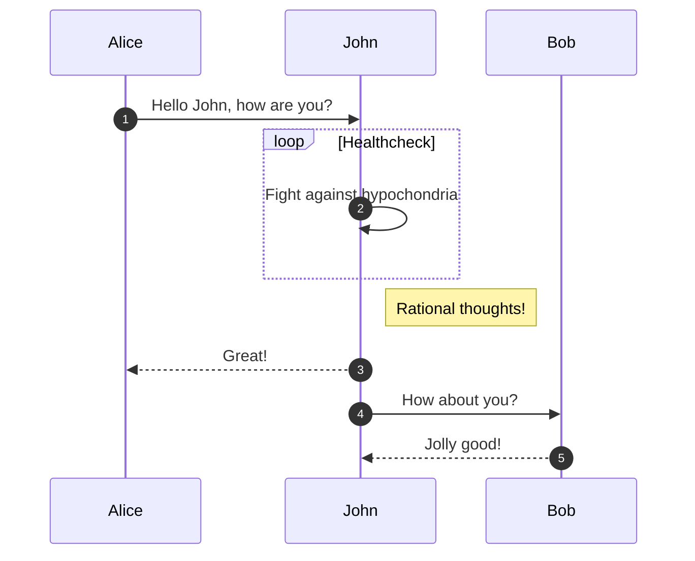
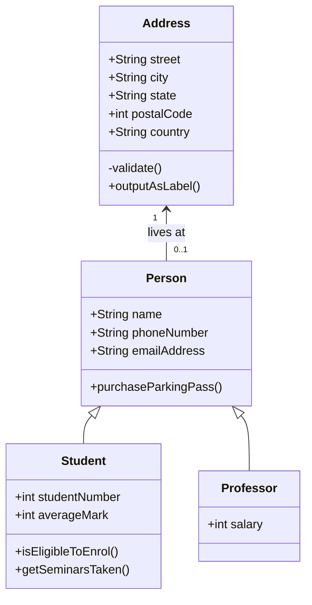

# MKDocs Mermaid

## Examples

```
  ```mermaid
  graph TD;
  A-->B;
  A-->C;
  B-->D;
  C-->D;
  ```
```


```
  ```mermaid
  graph TB

    SubGraph1 --> SubGraph1Flow
    subgraph "SubGraph 1 Flow"
    SubGraph1Flow(SubNode 1)
    SubGraph1Flow -- Choice1 --> DoChoice1
    SubGraph1Flow -- Choice2 --> DoChoice2
    end

    subgraph "Main Graph"
    Node1[Node 1] --> Node2[Node 2]
    Node2 --> SubGraph1[Jump to SubGraph1]
    SubGraph1 --> FinalThing[Final Thing]
  end
  ```
```



```
  ``` mermaid
  sequenceDiagram
    autonumber
    Alice->>John: Hello John, how are you?
    loop Healthcheck
        John->>John: Fight against hypochondria
    end
    Note right of John: Rational thoughts!
    John-->>Alice: Great!
    John->>Bob: How about you?
    Bob-->>John: Jolly good!
  ```
```



```
  ``` mermaid
  classDiagram
    Person <|-- Student
    Person <|-- Professor
    Person : +String name
    Person : +String phoneNumber
    Person : +String emailAddress
    Person: +purchaseParkingPass()
    Address "1" <-- "0..1" Person:lives at
    class Student{
      +int studentNumber
      +int averageMark
      +isEligibleToEnrol()
      +getSeminarsTaken()
    }
    class Professor{
      +int salary
    }
    class Address{
      +String street
      +String city
      +String state
      +int postalCode
      +String country
      -validate()
      +outputAsLabel()  
    }
  ```
```

